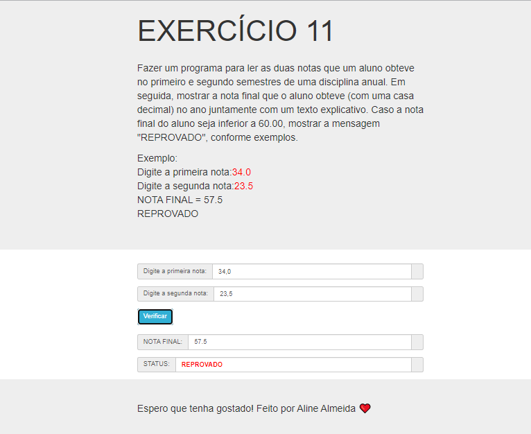

# Jovens Tegranos Exercicio 11

# 🏁 **Tópicos**

 * 👉 Banner
 * 👉 Título e Descrição
 * 👉 Status do Projeto
 * 👉 Funcionalidades
 * 👉 Demonstração da aplicação
 * 👉 Pré-requisitos
 * 👉 Tecnologias utilizadas
 * 👉 Autor
 * 👉 Licença
 
 ____________________________________________________________
# ✅ Banner 👌

<h1 align="center">
  
</h1>

# ✅ Título e Descrição 👌

### Exercicio 11

#### Fazer um programa para ler as duas notas que um aluno obteve no primeiro e segundo semestres de uma disciplina anual. Em seguida, mostrar a nota final que o aluno obteve (com uma casa decimal) no ano juntamente com um texto explicativo. Caso a nota final do aluno seja inferior a 60.00, mostrar a mensagem "REPROVADO", conforme exemplos.
    Digite a primeira nota: 34.0
    Digite a segunda nota: 23.5

    NOTA FINAL = 57.5
    REPROVADO
# ✅ Status do Projeto 👌

### 🚧 Projeto 🚀 **Concluído com Sucesso!!!** 👌 🚧

# ✅ Funcionalidades 👌

### - [x] Ler a nota que um aluno obteve no primeiro e segundo semestre de uma disciplina anual.
### - [x] Imprimir a nota final que o aluno obteve (com uma casa decimal) no ano juntamente com um texto explicativo..
### - [x] Caso a nota final do aluno seja inferior a 60.00, mostrar a mensagem "REPROVADO".

# ✅ Demonstração da aplicação 👌

<h1 align="center">
  
</h1>

### GitHub AlineAlmeida85

### Link: [Projeto](https://alinealmeida85.github.io/Jovens-Tegranos-Exercicio11/)

# ✅ Pré-requisitos 👌

### Nenhum, basta clicar no link acima

# ✅ Tecnologias utilizadas ⚒️ 👌

### As seguintes tecnologias foram usadas na construção do projeto:

- [HTML](https://pt.wikipedia.org/wiki/HTML)
- [CSS](https://pt.wikipedia.org/wiki/Cascading_Style_Sheets)
- [JavaScript](https://www.javascript.com/)

# ✅ Autor 👌

### Aline Almeida 💝

# ✅ Licença

### Não Possui

#### Espero que te agrade! ❤️
